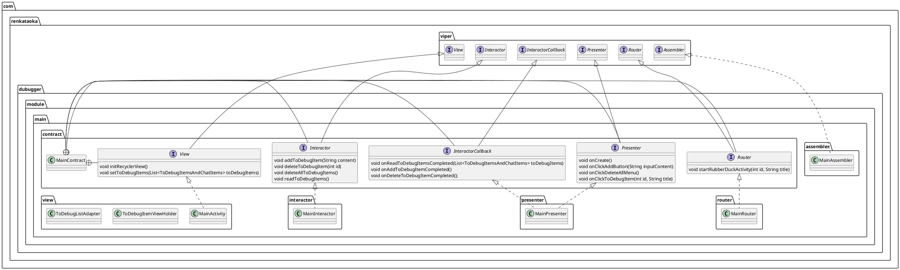
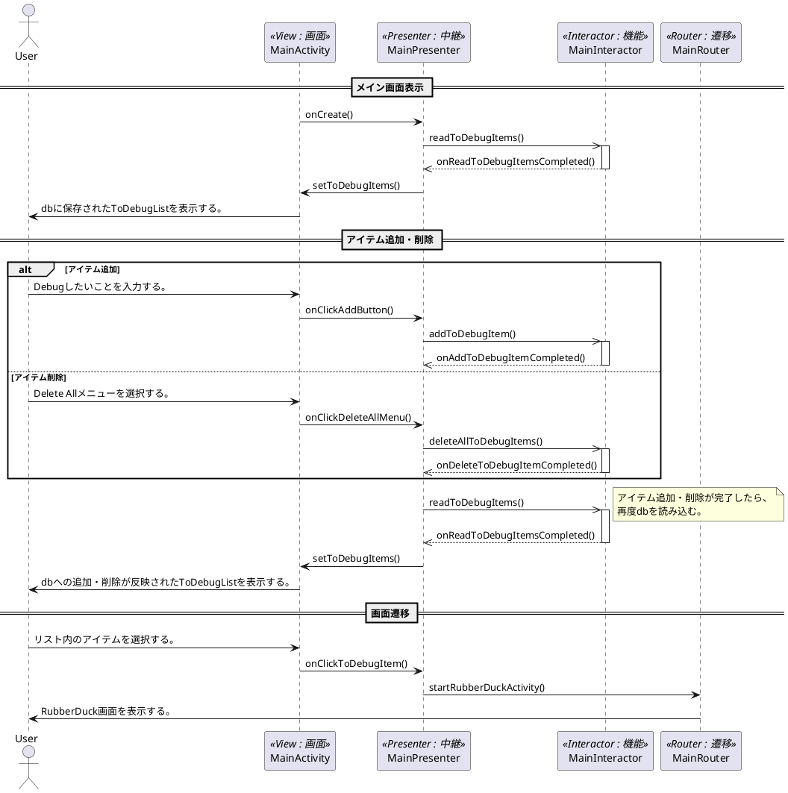

# メイン画面

## 概要

* 理解したいこと・理解を確かめたいことをリストアップする。

※「理解したいこと・理解を確かめたいこと」を**ToDebugItem**、そのリストを**ToDebugList**と呼ぶ。

## クラス

### [MainContract](../../app/src/main/java/com/renkataoka/dubugger/module/main/contract/MainContract.java)

* Contractクラス。
* VIPERモジュール間の連携APIを定義。

### [MainActivity](../../app/src/main/java/com/renkataoka/dubugger/module/main/view/MainActivity.java)

* VIPERモジュールのViewクラス。
* ToDebugListを表示する。
* ToDebugListの要素が選択されたことをキャッチする。

#### [ToDebugItemViewHolder](../../app/src/main/java/com/renkataoka/dubugger/module/main/view/ToDebugItemViewHolder.java)

* ToDebugItemの個別アイテムに対応するViewを保持するクラス。

#### [ToDebugListAdapter](../../app/src/main/java/com/renkataoka/dubugger/module/main/view/ToDebugListAdapter.java)

* ToDebugListのデータ(ToDebugItems)とRecyclerViewを繋ぐクラス。
* 個々のViewを提供するViewHolderを作成する。
* 個々のViewに対するクリックイベントを用意する。

### [MainInteractor](../../app/src/main/java/com/renkataoka/dubugger/module/main/interactor/MainInteractor.java)

* VIPERモジュールのInteractorクラス。
* 入力されたテキストをToDebugListに追加する。

#### [ToDebugItemsDataManager](../../app/src/main/java/com/renkataoka/dubugger/datamanager/ChatItemsDataManager.java)

* DBを操作するためのクラス。
* タスクを保存・修正・取得する。
* タスク完了状態を保存・修正・取得する。

### [MainRouter](../../app/src/main/java/com/renkataoka/dubugger/module/main/router/MainRouter.java)

* VIPERモジュールのRouterクラス。
* ToDebugListの各要素に対応するアクティビティへ遷移する。

### [MainPresenter](../../app/src/main/java/com/renkataoka/dubugger/module/main/presenter/MainPresenter.java)

* VIPERモジュールのPresenterクラス。
* View, Interactor, Routerと相互やり取りを行う。

### [MainAssembler](../../app/src/main/java/com/renkataoka/dubugger/module/main/assembler/MainAssembler.java)

* VIPERモジュールのAssemblerクラス。
* 具象クラスの依存性注入を行う。

## シーケンス図

